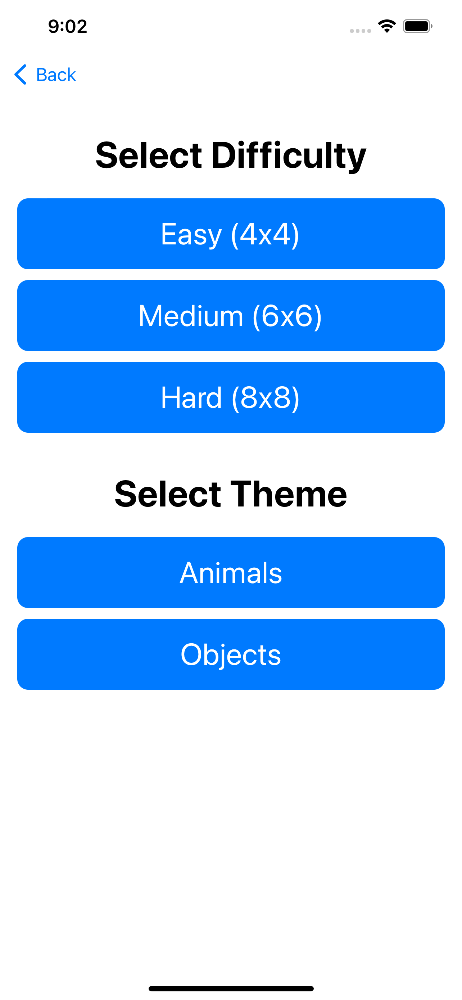
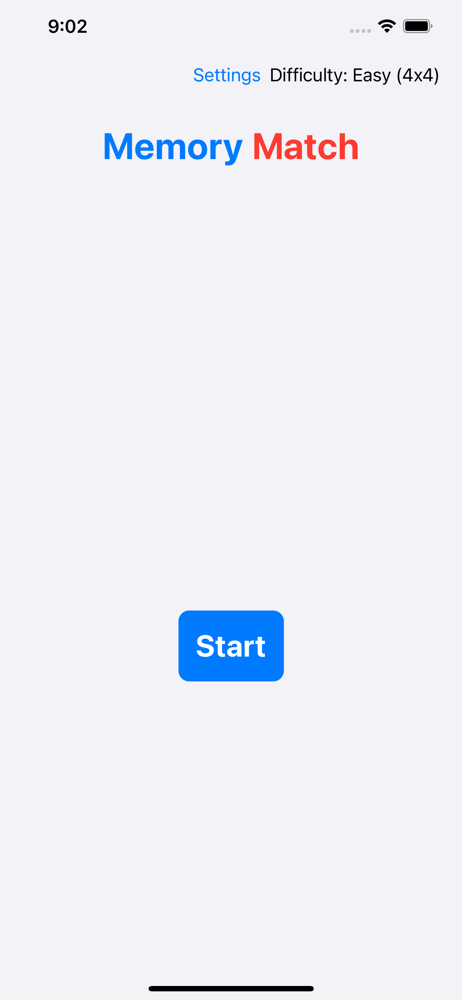
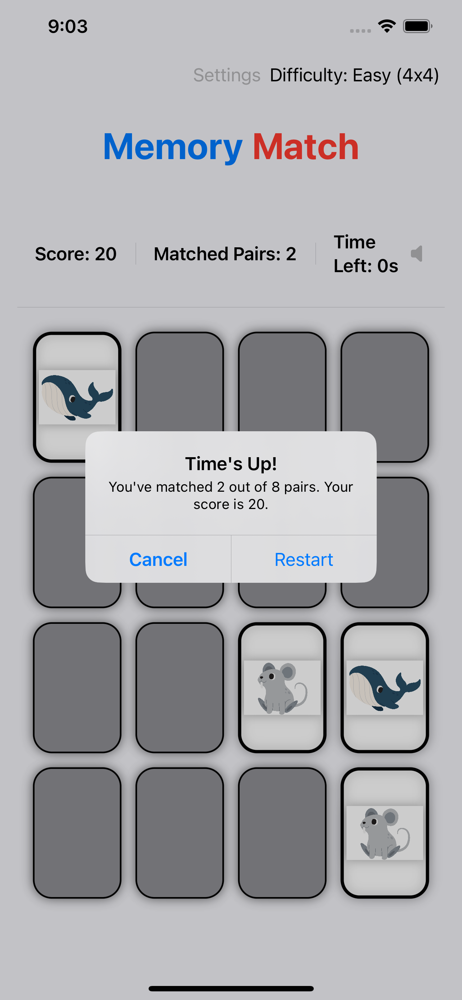
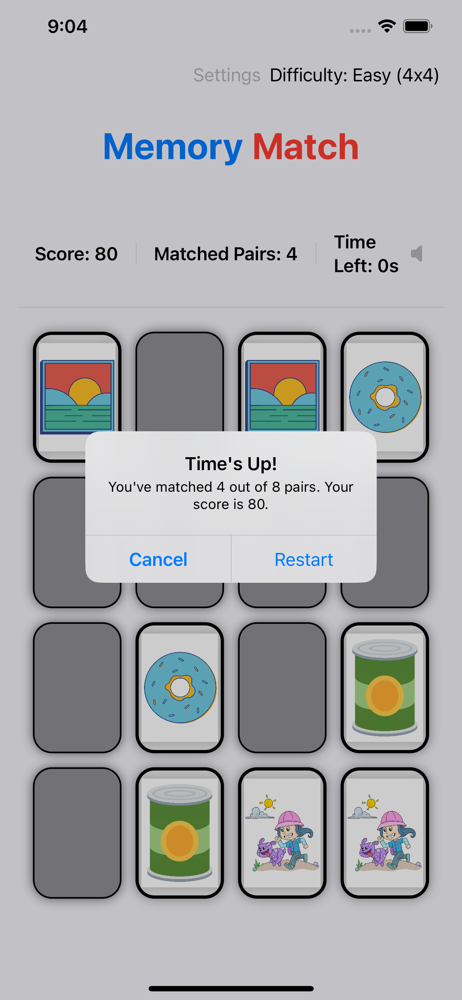

# Memory Match

Memory Match is a simple iOS game that challenges your memory and concentration skills. The goal of the game is to find all the matching pairs of cards within the allotted time.

## Features

- Multiple difficulty levels to choose from (Easy, Medium, Hard, and Expert)
- Multiple themes to choose from (Animals, Fruits, Objects, and Shapes)
- Sounds and haptic feedback to enhance user experience
- Keeps track of score and time taken to complete game
- Responsive design that adapts to both phones and tablets
- Animated splash screen

## Screenshots

## Requirements

- iOS 14.0 or later
- Xcode 12.0 or later

## Installation

1. Clone the repository to your local machine
2. Open the project in Xcode
3. Connect your iOS device to your computer and select it as the target device
4. Build and run the app

Alternatively, you can run the app on the iOS Simulator.

## Usage

1. Launch the app
2. Select a difficulty level and a theme
3. Tap the "Start" button to begin the game
4. Tap a card to flip it over and reveal its hidden image
5. Try to find the matching pair of the flipped cards
6. If the flipped cards match, they will remain face up and you will earn points
7. If the flipped cards do not match, they will be flipped back over
8. Continue until you have found all the matching pairs or the time runs out

## Contributing

Contributions are always welcome! If you would like to contribute to the project, please follow these steps:

1. Fork the repository
2. Create a new branch (`git checkout -b feature/my-feature`)
3. Make your changes
4. Commit your changes (`git commit -am 'Add some feature'`)
5. Push to the branch (`git push origin feature/my-feature`)
6. Create a new pull request

## License

Memory Match is available under the [MIT License](https://opensource.org/licenses/MIT). See the LICENSE file for more information.

